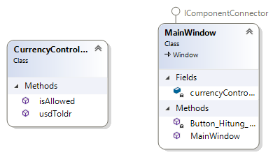

# Currency Apps
Aplikasi ini berfungsi untuk menghitung nilai tukar mata uang dari dollar ke rupiah.Pada aplikasi ini satu dollar senilai Rp.15.000
## Scope & Functionalities
- User dapat memasukan angka
- User dapat menyentuh tombol hitung
- User akan mendapatkan informasi"INVALID" jika memasukan huruf

## How does it works?
Pertama program akan mengeksekusi terlebih dahulu ,method dibawah ini:

'''
      
      public MainWindow()
        {
            InitializeComponent();
            currencyController = new CurrencyController();
            
        }

'''

Lalu pada private void Button_Hitung_Clik terdapat logic untuk menangani human error berupa kesalahan input.ketika user menginput angka maka terdapat info "INVALID".

'''

    private void Button_Hitung_Click(object sender, RoutedEventArgs e)
        {
            var nominalInput = InputTextBox.Text;

            var result = "invalid";
            if (currencyController.isAllowed(nominalInput))
            {
                result = currencyController.usdToIdr(nominalInput);
            }
            resultLabel.Content = result;
      
        }
'''
Logic dari perhitungan terdapat pada class CurrencyController.cs.Logikanya seperti dibawah ini:
'''   

 
     
     public string usdToIdr(string nominal)
        {
            var nominalDouble = Convert.ToDouble(nominal);
            var result = nominalDouble * 15000;
            return Convert.ToString(result);
      
        }
'''
## Latihan
1.	Review kembali percobaan 1 sampai dengan 3 dengan menjawab pertanyaan-pertanyaan pada latihan tersebut.

#### Jawaban
- Percobaan 1:Ketika memasukkan sembarang angka dan tulisan lalu klik tombol Hitung, maka hasilnya akan sama seperti yang masukan.
- Percobaan 2:
    
    1.Ketika memasukkan sembarang angka lalu klik tombol Hitung, maka yang terjadi yaitu angka yang kita masukan akan dikalikan dengan 15000.
    
    2.Ketika memasukkan sembarang huruf lalu klik tombol Hitung, maka akan terjadi crash pada aplikasi
- Percobaan 3
    
    1.Ketika memasukkan sembarang angka lalu klik tombol Hitung,maka angka akan dikalikan 15000
    
    2.Ketika memasukkan sembarang huruf lalu klik tombol Hitung ,maka akan tampil tulisan"invalid".
- Percobaan 4 :Ketika memasukkan sembarang angka dan tulisan lalu klik tombol Hitung,maka akan tampil tulisan "invalid".

2. Mengapa perlu membuat class CurrencyController.cs pada percobaan 4 ?
 #### Jawaban
Class CurrencyController.cs diperlukan untuk memisahkan tampilan dengan logic  perhitungan.

3. Jelaskan kegunaan method isAllowed pada percobaan 4!  
#### Jawaban
Method isAllowed digunakan untuk menyeleksi inputan dari inputtext, jika inputtextbox berupa angka akan dilakukan perhitungan ,jika yang diinputkan huruf akan menampilkan kata"invalid".

4. Jelaskan secara singkat mengenai Regex pada percobaan 4!
#### Jawaban
Regex digunakan untuk mencari pola  fungsi Regex("[^0-9.-]+");

5. Buatlah class diagramnya pada percobaan 4!
#### Jawaban 

